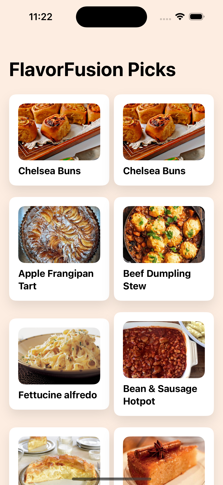
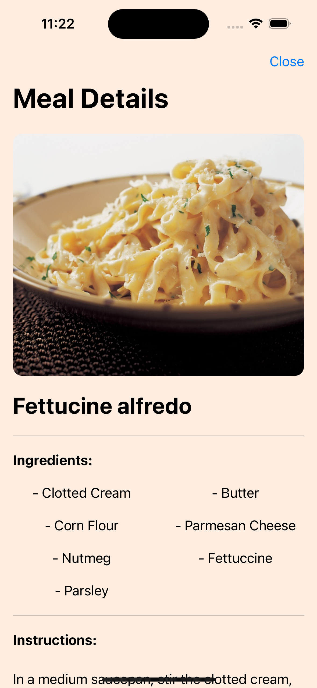
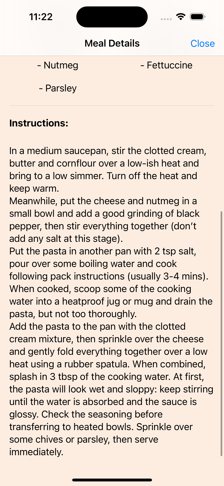
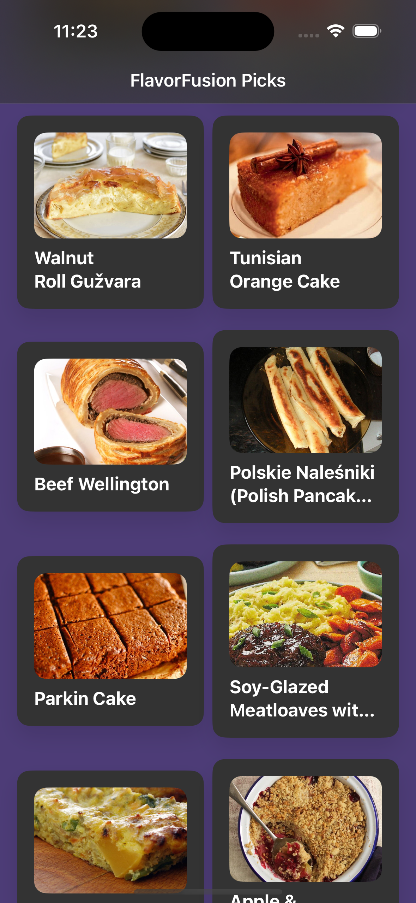
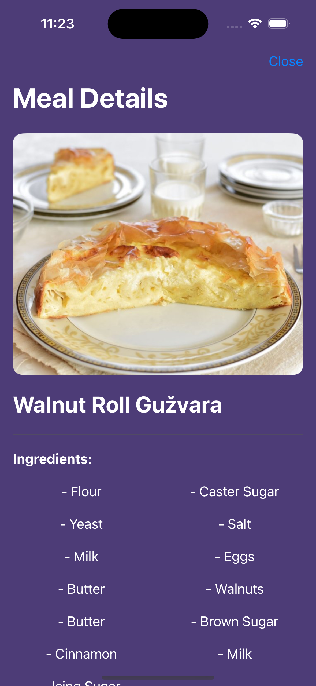
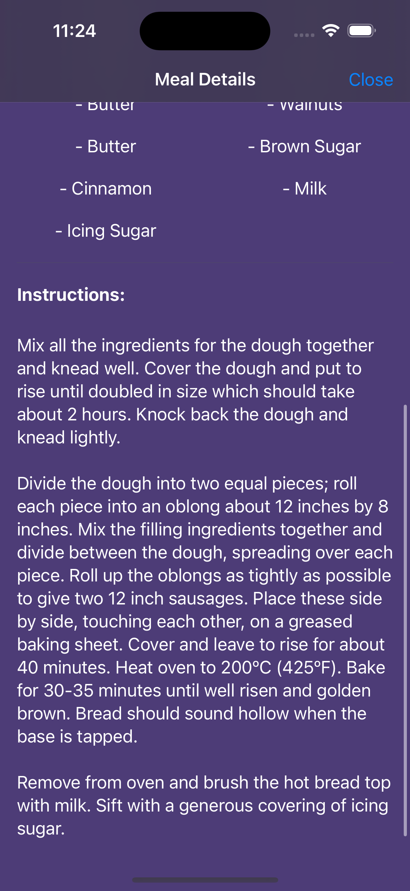

# FlavorFusion

FlavorFusion is a SwiftUI-based iOS app that provides users with a variety of meal recommendations fetched from an online database. Users can explore different meals, view their details, and discover new recipes.

## Features

- Fetches random meal recommendations from an online API.
- Displays meal cards with images and brief descriptions.
- Allows users to view detailed information about each meal, including ingredients and instructions.
- Supports both light and dark mode.

## Technologies Used

- **SwiftUI:** Used for building the user interface.
- **Combine:** Used for reactive programming and data flow management.
- **URLSession:** Used for networking to fetch data from the API.
- **JSONSerialization:** Used for parsing JSON data from the API response.

## Installation

To run the app on your iOS device or simulator, follow these steps:

1. Clone the repository to your local machine.
2. Open the project in Xcode.
3. Build and run the project using Xcode's built-in simulator or connect your iOS device and select it as the deployment target.

## How to Use

Upon launching the app, FlavorFusion fetches random meal recommendations from an online database. Users can scroll through the list of meals, tap on a meal card to view its details, and explore its ingredients and instructions.

## Credits

This app was created by Fahad Waseem.

Special thanks to TheMealDB for providing the meal database used in this app.

## Contributing

Contributions are welcome! If you have any suggestions, bug reports, or feature requests, please open an issue or submit a pull request.
